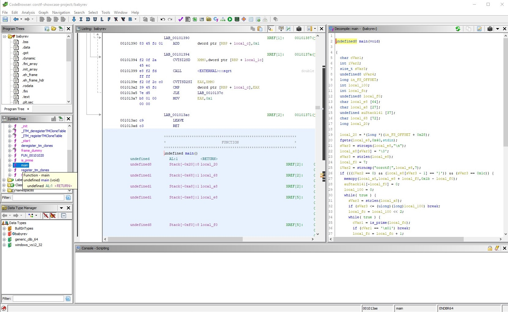
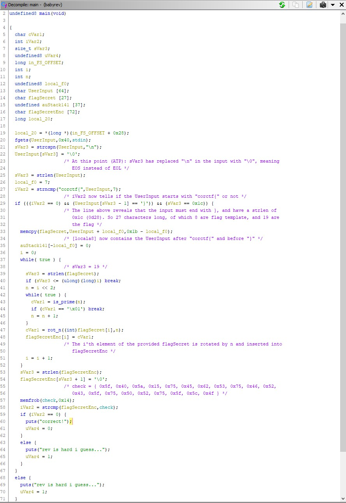
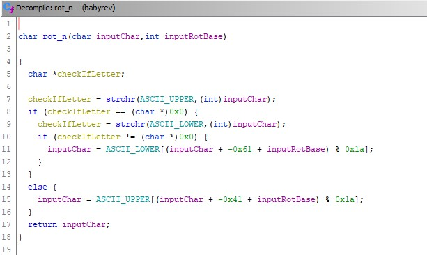
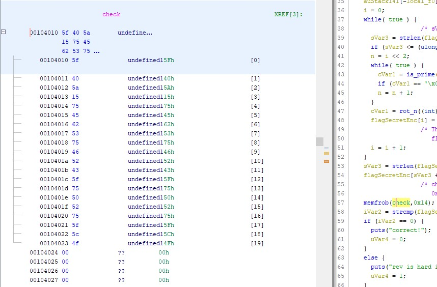

# corCTF Write-ups

## crypto/fibinary

### About the task
#### Task description
*Warmup your crypto skills with the superior number system!*
#### Task files
[enc.py](https://corctf2021-files.storage.googleapis.com/uploads/cbc718b0b14f91af5c231ed0b6091d2336484619d536bce505a34fa27ec90be8/enc.py)   
[flag.enc](https://corctf2021-files.storage.googleapis.com/uploads/034184c574279b6889c553d222d2f8c8f1725b56f70f9acb4bc716bc7cabf8df/flag.enc)
#### Task author
*quintec*
#### Task url
*https://2021.cor.team/challs*

### Write-up
#### Understanding the task
After reading the task description and quickly looking at the files we are given a few things immediately stand out:
The file flag.enc seems to be written in some sort of binary
The enc.py program uses a homemade algorithm to encrypt the contents of "flag.txt".

The algorithm seems to rely on non-destructive mathematical operators, like addition and subtraction.
The fib variable looks and sounds like a fibbonachi sequence.

The flag.enc looks like a binary file, but if you attempt to paste it into cyberchef, or any other program that decodes binary, you will quickly see that it does not contain the flag in plaintext. Therefore we have to look at the program that made the file, enc.py.

```python
fib = [1, 1]
for i in range(2, 11):
	fib.append(fib[i - 1] + fib[i - 2])

def c2f(c):
	n = ord(c)
	b = ''
	for i in range(10, -1, -1):
		if n >= fib[i]:
			n -= fib[i]
			b += '1'
		else:
			b += '0'
	return b


flag = open('flag.txt', 'r').read()
enc = ''
for c in flag:
	enc += c2f(c) + ' '
with open('flag.enc', 'w') as f:
	f.write(enc.strip())
```

Working backwards through enc.py you can see that the string that is written to flag.enc is first generated by sending one character at a time into the function 'c2f()'. An annotated version of enc.py can be found [here](corCTF/fibinary/enc.py), but in short: c2f() transforms the character into an ASCII value and does a number of checks on it with the 11 first numbers in the fibbonachi sequence. From one character that is passed into c2f, 8 'bits' are returned and written to flag.enc. I say 'bits' cause even though it is written in groups of 8 with 1's and 0's the numbers that return represent values differently than normal binary numbers would.

#### Solving the task
The next step is to make a python program of our own that can reverse the effect enc.py had on the flag. My "dec.py" program simply used a function that did the exact opposite of the c2f() function. In a great burst of creativity I decided to call it "f2c()":

```python
fib = [1, 1, 2, 3, 5, 8, 13, 21, 34, 55, 89]

def f2c(c):
	cDec = 0
	for i in range(0,10):
		if c[i] == '1':
			cDec += fib[10-i]
	return chr(cDec)

flagEnc = open('flag.enc','r').read().split()
flag = ''
for c in flagEnc:
	flag += f2c(c)
print(flag)
```
 
Running this program decrypts the flag.enc file and returns the flag:

<details>
<summary> Flag </summary>
<pre> <b> corctf{b4s3d_4nd_f1bp!113d}</b> </pre>
</details>

## rev/babyrev

### About the task
**Task description:**
*well uh... this is what you get when you make your web guy make a rev chall*

**Task files:**
[babyrev.tar.xz](https://corctf2021-files.storage.googleapis.com/uploads/13d76fd64af3b5265a84197bc403acf2a7fbbf820dc83e8e9d8e741e06a2026a/babyrev.tar.xz)

**Task author:**
*Strellic*

**Task url:**
*https://2021.cor.team/challs*

### Write-up
As my experience with solving rev challenges is very limited my tactic going into this task was to just open the executable file with Ghidra and hope that I would be able to understand the programflow in the main() function.



Viewing the C-code generated by Ghidra is still not very intuative, so the first thing to do is to go through the code and make it more readable. To do this every function that is used in the code has to be understood, and variable names should be changed to something that makes sense. I also used comments a lot to keep track of what the different variables represented at different times, and what the program was doing.



Much like the task fibinary (just above) this task also uses a lot of code to generate an array of numbers that is similar every time the program is run. In this case this happens on the lines 37-46, where a determinable array of primes is generated: 
<details>
<summary> Array of primes</summary>
<rev> [2,5,11,13,17,23,29,29,37,37,41,47,53,53,59,61,67,71,73,79] </rev>
</details>

These primes where then used as bases to rotate each character in the secret part of the flag with. In order to understand what kind of rotation was done to these characters we have to examine the function *rot_n()*. Since Ghidra is nice enough to show us the implementation of the function when we double-click it this is not too hard:



Personally I did very little to make this auto generated code more readable, since all I was really interested in was the properties of the rotation function. I.e:
* Does the rotation function rotate letters into symbols? [No]
..* If not, does the function rotate lower-case letters into upper-case letters? [No]
* Does the function rotate symbols, and if so how? [Does not rotate symbols]
* Does the function really rotate each character by the amount given to it, or is it trying to fool us? [It really does rotate by the given amount]

Now looking at the code in the main() function again on line 57-62. We can see that the flag rotated by this function is supposed to return the variable that is defined as *'check'* (it is worth noting that I did not rename this variable, it simply showed up in Ghidra with that name). So if we can read the check variable and reverse the effect of the rotation function on each byte we should be able to recover the secret part of the flag. To read the check variable it is once again a simple case of double-clicking it:

<details>
<summary> check: </summary>


```
check = {0x5f,0x40,0x5a,0x15,0x75,0x45,0x62,0x53,0x75,0x46,0x52,0x43,0x5f, 0x75,0x50,0x52,0x75,0x5f,0x5c,0x4f}
```

</details>

Given the encrypted flag (the check values) and the function of the rotation function I was able to construct a python program that reversed the rotation cipher:

```python
import sympy
import string

check = [0x75,0x6a,0x70,0x3f,0x5f,0x6f,0x48,0x79,0x5f,0x6c,0x78,0x69,0x75,0x5f,0x7a,0x78,0x5f,0x75,0x76,0x65]

#check = [0x41,0x42,0x43]

ascii_lower = string.ascii_lowercase
ascii_upper = string.ascii_uppercase


for n in range(len(check)):
    bNum = n * 4
    while(True):
        if sympy.isprime(bNum):
            #print(bNum,end=",")
            break
        bNum += 1
    charToPrint = check[n]
    if(64 < check[n] < 91):
        charToPrint = ord(ascii_upper[((check[n] - 65) - bNum) % 26])
    if(96 < check[n] < 123):
        charToPrint = ord(ascii_lower[((check[n] - 97) - bNum) % 26])
    print(chr(charToPrint),end="")
```
Which leaves us with the flag:
<details>
<summary> Flag: </summary>
<b> 

```
corctf{see?_rEv_aint_so_bad}
```
</b>
</details>

